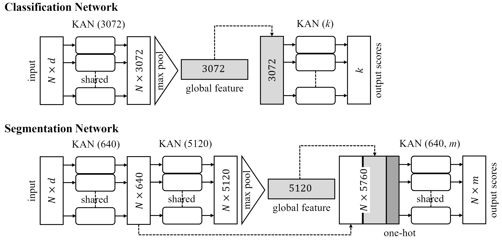

# PointNet with KAN versus PointNet with MLP for 3D Classification and Segmentation of Point Sets



**Abstract** <be>

We introduce PointNet-KAN, a neural network for 3D point cloud classification and segmentation tasks, built upon two key components. First, it employs Kolmogorov-Arnold Networks (KANs) instead of traditional Multilayer Perceptrons (MLPs). Second, it retains the core principle of PointNet by using shared KAN layers and applying symmetric functions for global feature extraction, ensuring permutation invariance with respect to the input features. In traditional MLPs, the goal is to train the weights and biases with fixed activation functions; however, in KANs, the goal is to train the activation functions themselves. We use Jacobi polynomials to construct the KAN layers. We extensively evaluate PointNet-KAN across various polynomial degrees and special types such as the Lagrange, Chebyshev, and Gegenbauer polynomials. Our results show that PointNet-KAN achieves competitive performance compared to PointNet with MLPs on benchmark datasets for 3D object classification and segmentation, despite employing a shallower and simpler network architecture. We hope this work serves as a foundation and provides guidance for integrating KANs, as an alternative to MLPs, into more advanced point cloud processing architectures.

**Installation** <be>
This guide will help you set up the environment required to run the code. Follow the steps below to install the necessary dependencies.

**Step 1: Download and Install Miniconda**

1. Visit the [Miniconda installation page](https://docs.conda.io/en/latest/miniconda.html) and download the installer that matches your operating system.
2. Follow the instructions to install Miniconda.

**Step 2: Create a Conda Environment**

After installing Miniconda, create a new environment:

```bash
conda create --name myenv python=3.8
```

Activate the environment:

```bash
conda activate myenv
```

**Step 3: Install PyTorch**

Install PyTorch with CUDA 11.8 support:

```bash
pip3 install torch torchvision torchaudio --index-url https://download.pytorch.org/whl/cu118
```

**Step 4: Install Additional Dependencies**

Install the required Python libraries:

```bash
pip3 install numpy matplotlib trimesh torchsummary
```

The rest of the guidance for running the code is embedded in the classification and segmentation folders.
